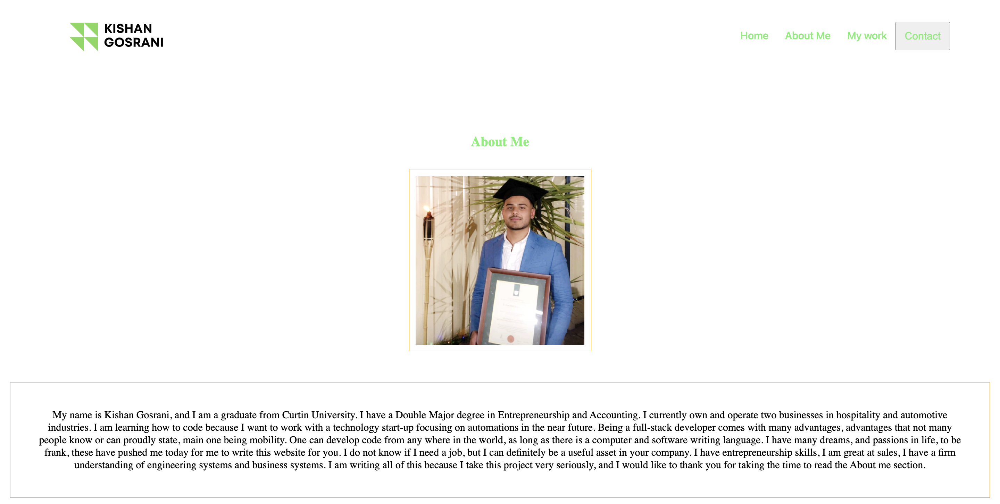
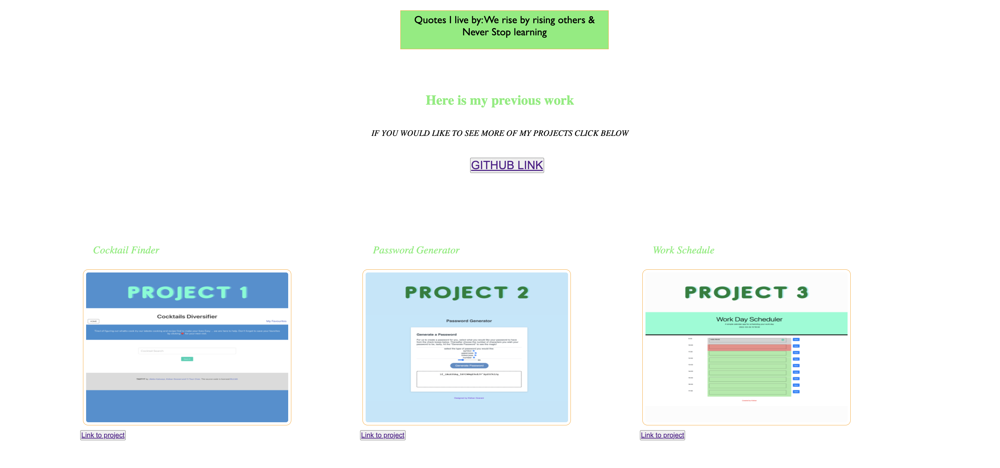
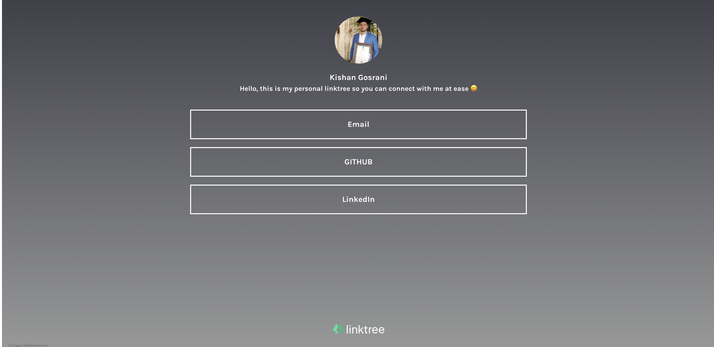
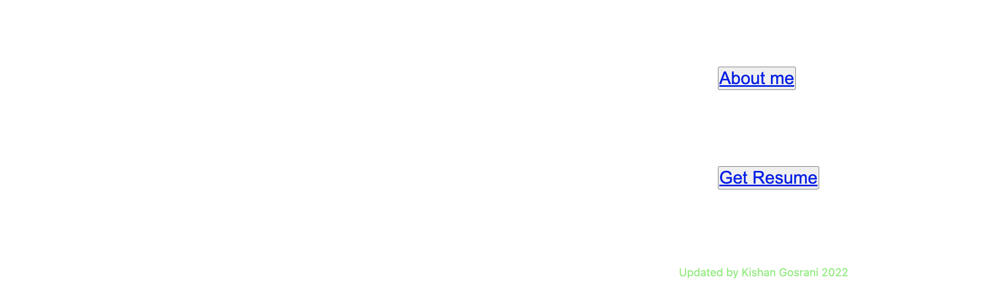

# 2021_Omicron_Portfolio

THIS PROJECT IS UTILISING THE SKILLS LEARNT IN MY CLASS TO SHOWCASE - "FLEXBOX, MEDIA QUERIES AND CSS VARIABLES"

## Tabel of Contents

* [Links](#Links)
* [Screeshots](#Screenshots)
* [Questions](#Questions)

# Links

This is the link to my work https://kishan254.github.io/2021_Omicron_Portfolio/

This is the link to my Githiub Repo https://github.com/kishan254/2021_Omicron_Portfolio

# Screenshots

## Questions

Please click the links below

[Github] (https://github.com/kishan254)

Write me on;

[Email] (kishan.gosrani@hotmail.com)
